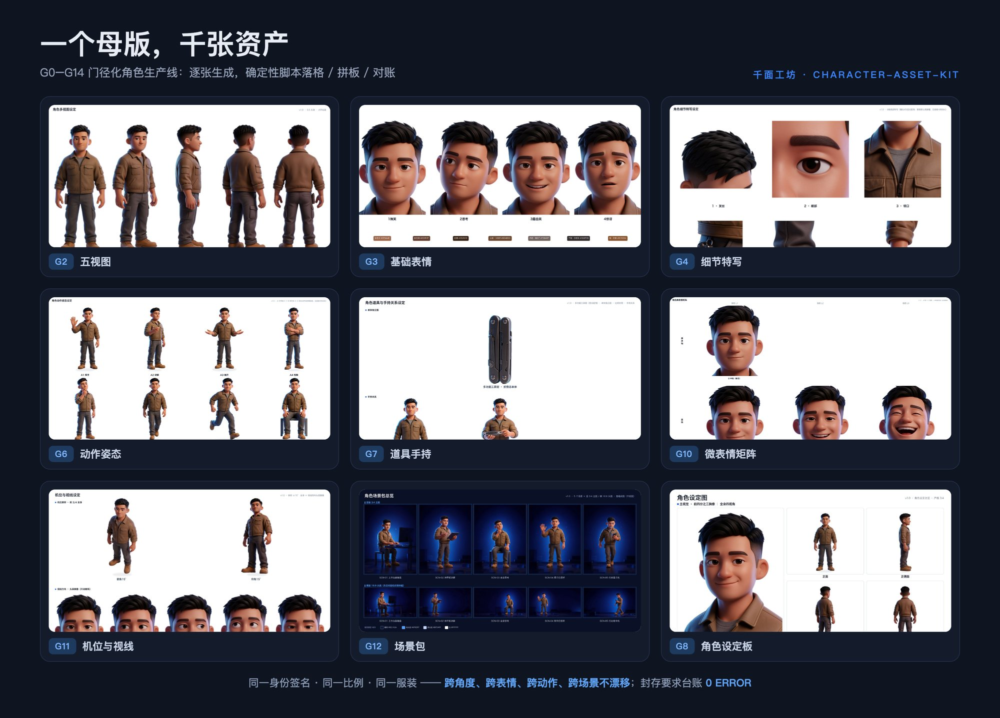
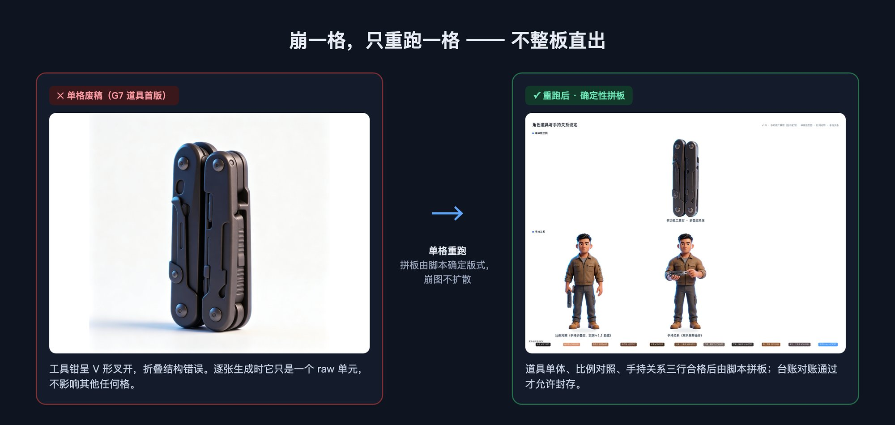
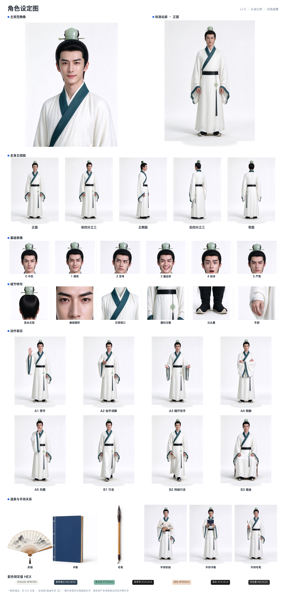
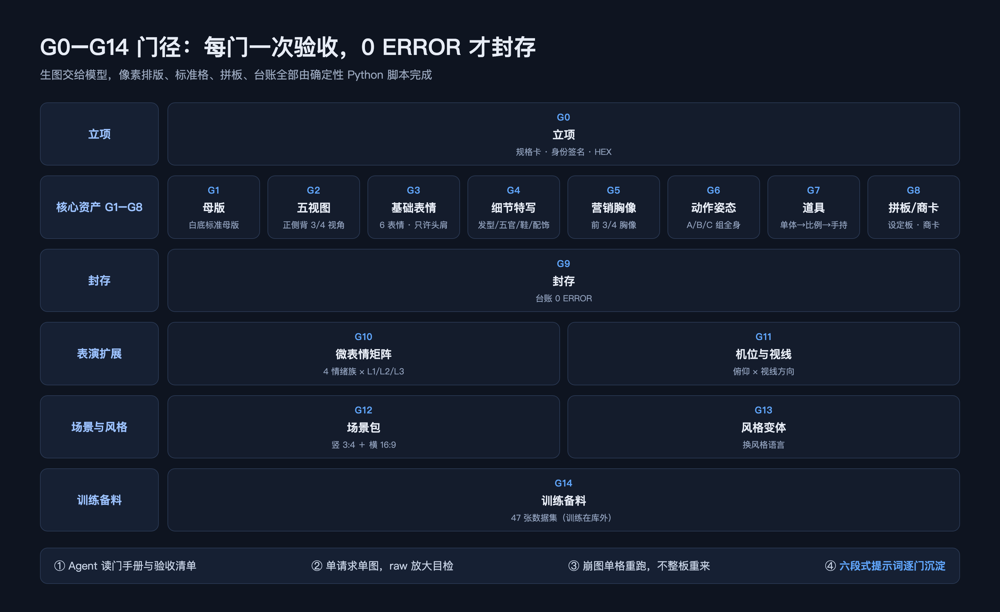
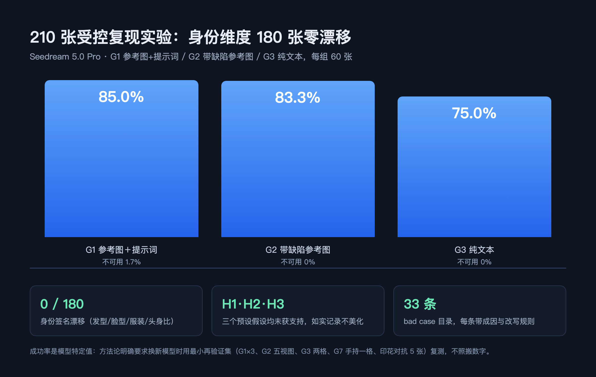
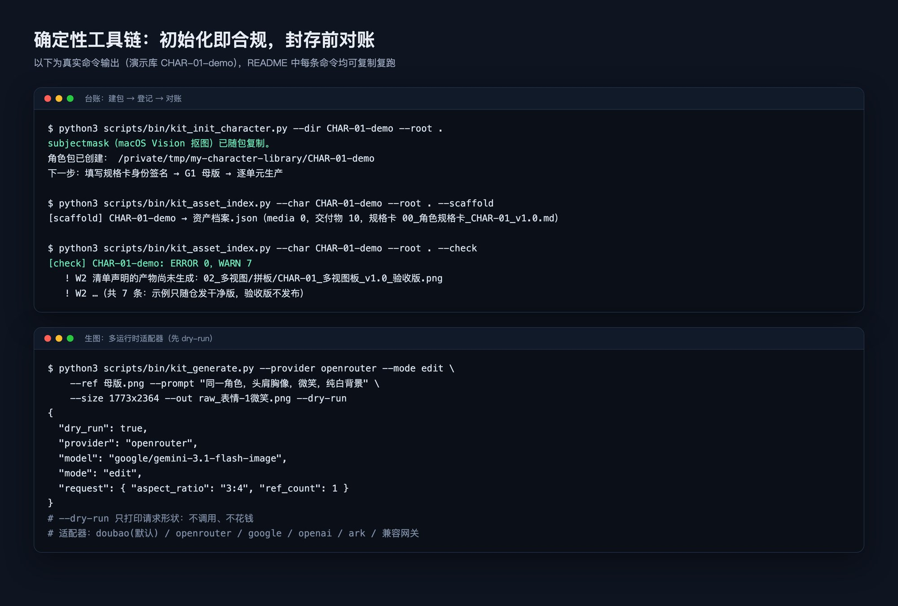

# 千面工坊 · 角色资产生产线（character-asset-kit）

> **千面如一**：一个身份锚点，千张资产不漂移。
> 把一个新角色按企业级门径（G0–G14）做成**跨角度、跨表情、跨动作、跨场景、可训练备料、可对账**的 AIGC 角色资产库的 Agent Skill。
> Agent 负责生图与编排，本 Skill 提供门径 SOP、实证提示词方法论与确定性脚本。

English: [README.en.md](README.en.md)

[](https://www.skills.sh/PolinniZhong/character-asset-kit)

## 一分钟装上

```bash
npx skills add PolinniZhong/character-asset-kit
```

装好后对 Agent 说一句“用千面工坊建一个新角色”，一个角色会被做成整套**可复用、不崩脸**的资产：白底母版与五视图、表情板、动作姿态板、道具手持关系、机位视线、场景包、造型/风格变体、角色设定板与可审计台账；需要训练时还会自动备料数据集。



## 它解决什么问题

"能生成一个好看的角色"和"拥有一个稳定可复用的角色资产"是两件事。后者需要：

1. **身份先冻结再量产**：规格卡 → 白底母版，之后一切单元回指母版；
2. **单元直出、确定性拼板**：多视图/表情/动作逐张生成，脚本抠图落标准格并拼板，杜绝"整板直出必崩"；
3. **门径与验收**：每门有验收清单，用户过门才推进，台账对账 0 ERROR 才封存；
4. **提示词资产化**：每张定稿图六段式沉淀（用途/喂料/原文/尺寸/验收/bad case）；
5. **实证的改写规则**：210 张受控复现实验的结论——参考图通道强于文字通道；模型听定性/数量/禁止词，不听数值/状态词；信息缺失改提示词即可，人体几何必须提示词＋参考图组合。



## 角色成品展示

以下是用本 Skill 生产的真实角色商卡（一女一男，古风真人 profile）。每张商卡包含：主视觉胸像、标准站姿、全身五视图、基础表情、细节特写、道具手持、动作姿态——一张图看清整套资产长什么样。

**温以宁（女，24岁，书肆主人）** — 藕紫偏粉齐腰襦裙，半披发高发髻，古风真人


**候书（男，26岁，江南文人）** — 月白交领长衫墨青镶边，束发青玉冠，温以宁青梅竹马



> 商卡由 `kit_build_board.py --type card` 确定性拼板生成，标签在画面外不压像素；所有单图均经标准格落格与台账对账。

## 现状（最新 v1.3.1，2026-09-24）

- **内置三套风格 profile**：`gates-blindbox3d-v1`（3D 盲盒手办，默认）、`gates-realhuman-v1`（真人写实摄影）、**`gates-realhuman-gufeng-v1`（中国古风真人）**——门径与确定性脚本完全复用，换风格只换 profile；真人线核心是「真实皮肤方法论」，古风线核心是「低饱和淡雅色调＋丰富发型三级锚定」。
- 方法论在两个完整 3D 角色（G0–G14 全门）上跑通；第三个角色由**全新对话只靠本 Skill** 完成 dogfooding（G0–G12，106 件媒体、17 件派生交付物、封存 0 ERROR/0 WARN，见 [`docs/DOGFOODING.md`](docs/DOGFOODING.md)）；真人写实 profile 也已在两个完整真人角色（KR-01 韩东、KR-02 姜书媛，G0–G14）上实证。
- 画风、门集合、插槽、画幅全部 **profile 化**，**不绑定任何角色或画风**；新增风格只需选/复制 profile。
- **评测与工程化**：[`evals/`](evals/) 提供 L1 触发测试、L2 质量 A/B（裸模型 vs Skill）与五维 rubric；`skill.yaml` 为结构化元数据；GitHub Actions CI（Python 3.10/3.12/3.14）自动跑单测与密钥扫描。
- [`examples/CHAR-01-demo/`](examples/CHAR-01-demo/) 提供一套真实产线输出的**脱敏成品板**（10 张，G2–G12），可直接查看各板型长相。



方法论不是拍脑袋：**210 张受控复现实验 = 180 张三组主实验（G1/G2/G3 各 60）＋ 30 张 P1 提示词改进验证**；身份签名维度按 **180 张主实验零漂移**统计（另有 15 张 G1 探路批门槛预演不计入，过程总生成 225 张）。三个预设假设 H1/H2/H3 均未获支持，结论如实记录、不做美化。成功率是 Seedream 5.0 Pro 的模型特定值，换新模型必须跑最小再验证集，不照搬数字。



## 目录

```
character-asset-kit/
├── SKILL.md                     # Agent 入口：硬约束、门径地图、按需加载表
├── references/                  # 方法论大脑（Agent 按需读取）
│   ├── gates-g0-g9.md           #   核心九门作业手册
│   ├── gates-g10-g14.md         #   微表情/机位视线/场景/风格变体/训练备料
│   ├── prompt-framework.md      #   六段式提示词模板
│   ├── prompt-rewrite-rules.md  #   实证改写规则（210 张实验）
│   ├── bad-cases.md             #   崩图目录 BC-01…33
│   ├── acceptance-checklists.md #   逐门验收清单
│   ├── registry-rules.md        #   台账 E/W 规则码
│   ├── runtime-portability.md   #   跨模型/跨运行时移植与最小再验证
│   └── style-profiles.md        #   怎么换画风/裁剪门
├── profiles/                    # 风格 profile：gates-blindbox3d-v1（3D，默认）/ gates-realhuman-v1（真人写实）
├── evals/                       # L1 触发测试、L2 质量 A/B 任务与 rubric、统计脚本
├── templates/                   # 规格卡、资产清单、训练配置模板
├── scripts/                     # 确定性工序（Python 3.10+ / Pillow）
│   ├── charkit/                 #   抠图、标准格、九种拼板、字体
│   └── bin/                     #   init / generate / standard_cell / colorkey_cutout /
│                                #   build_board / asset_index / scene_board /
│                                #   style_board / trainset / secret_scan（+ subjectmask.swift）
├── tests/                       # 纯标准库 unittest（不联网、不依赖 macOS Vision）
├── examples/                    # 脱敏的端到端走查
└── docs/                        # PRD / DESIGN（SDD）/ DOGFOODING
```

## 快速开始

1. 把本目录放进 Agent 的 skill 发现路径（豆包：`~/.doubao/agent_mode/workspace/.user_skills/`，软链即可；其他 Agent 按其 Skill 约定放置）。
2. 用户说"建一个新角色"，Agent 读 `SKILL.md` 并初始化角色包：
   ```bash
   python3 scripts/bin/kit_init_character.py --dir CHAR-01-demo --root /path/to/library
   ```
3. 与用户共写规格卡（G0）→ 母版（G1）→ 逐门推进到封存（G9）；扩展门 G10–G14 按需启用。
4. 每门的喂料、脚本命令、验收项在 `references/` 按需读取。

典型脚本用法：

```bash
# raw 落标准格（macOS 自动抠图；非 macOS 先自行抠图再 --already-cutout）
python3 scripts/bin/kit_standard_cell.py --char CHAR-01-demo --unit master --in raw.png --variant white
# 深色道具 Vision 失败时的纯白底色键兜底
python3 scripts/bin/kit_colorkey_cutout.py raw.png cut.png
# 拼板（干净版 / 验收版）
python3 scripts/bin/kit_build_board.py --char CHAR-01-demo --type multiview
python3 scripts/bin/kit_build_board.py --char CHAR-01-demo --type all --review
# 台账登记与对账（封存要求 0 ERROR）
python3 scripts/bin/kit_asset_index.py --char CHAR-01-demo --scaffold
python3 scripts/bin/kit_asset_index.py --char CHAR-01-demo --check
```



## 非豆包运行时（OpenRouter / Gemini / OpenAI / 方舟 / 兼容网关 / 本地 CUDA）

生产线与出图解耦：豆包运行时默认用宿主工具 `image_gen`/`image_edit`（`seedream_5.0_pro`）；其他运行时用自带适配器 `scripts/bin/kit_generate.py`（纯标准库，无新增依赖），五家提供商：

| provider | 密钥环境变量 | 默认模型 | 参考图 |
|---|---|---|---|
| `openrouter`（推荐） | `OPENROUTER_API_KEY` | `google/gemini-3.1-flash-image` | 随模型，一把 key 触达约 30 个图像模型 |
| `google` | `GOOGLE_API_KEY` | `gemini-2.5-flash-image` | 强，上限 3（gemini-3 族 14） |
| `openai` | `OPENAI_API_KEY` | `gpt-image-2.5-flare` | multipart，上限 16 |
| `ark` | `ARK_API_KEY` | 无，`--model` 传推理端点 | 看端点模型 |
| `custom` | `OPENAI_API_KEY` + `OPENAI_BASE_URL` | 无，`--model` 显式传 | 任意 OpenAI Images 兼容网关 |

```bash
export OPENROUTER_API_KEY=...
# 先 dry-run 核对请求形状（不调用、不花钱）
python3 scripts/bin/kit_generate.py --provider google --mode edit --ref 母版.png \
  --prompt-file p.txt --size 1773x2364 --dry-run
# 文生图 / 多参考编辑（一次一张；非 PNG 返回自动转 PNG）
python3 scripts/bin/kit_generate.py --provider openrouter --mode gen \
  --prompt-file p.txt --size 1773x2364 --out 99_过程稿/raw.png
python3 scripts/bin/kit_generate.py --provider google --mode edit \
  --ref 母版.png --ref 参考.png --prompt "……" --size 1773x2364 --out raw.png
```

模型解析：`--model` ＞ 环境变量 `<PROVIDER>_IMAGE_MODEL` ＞ 内置默认；429/5xx 自动重试 2 次，4xx 不重试。
门径、提示词框架、落格、拼板、台账与模型无关；但 210 张服从度实验结论是 seedream 特定的，**换模型前必须按 [runtime-portability.md](references/runtime-portability.md) §4 跑 G1/G2/G3/G7 最小再验证**。本地 CUDA（ComfyUI/Flux/SD）按该文 §7 的 CLI 契约自包一层。

## 环境

- Python 3.10+、Pillow（`pip install pillow`），纯 Python 侧无其他必需依赖。
- 自动抠图（subjectmask）依赖 **macOS Vision**：Swift 源码随仓，首次 init 自动 `swiftc` 编译（只发源码不发二进制）。非 macOS 用任意抠图工具后传 `--already-cutout`，或对纯白底素材用跨平台色键脚本 `kit_colorkey_cutout.py`。
- 生图模型与工具由运行时提供；默认绑定豆包 `seedream_5.0_pro`，OpenRouter/Gemini/OpenAI/方舟/兼容网关走 `kit_generate.py`，详见 [runtime-portability.md](references/runtime-portability.md)。
- 中文字体跨平台回退（拼板/商卡的中文标题必需）：macOS 苹方/冬青黑体 → Linux Noto Sans CJK/文泉驿/Droid（CI 自动安装 `fonts-noto-cjk`）→ Windows 微软雅黑/黑体。**任何平台都可用 `CHARKIT_FONT=/path/to/font.ttc`（配合 `CHARKIT_FONT_INDEX`、`CHARKIT_FONT_BOLD`）显式覆盖**，适合精简镜像或没预装中文字体的容器；一个字体都没找到时，报错会直接给出对应平台的安装/覆盖命令。

## 测试

```bash
python3 -m unittest discover -s tests -v
```

## 边界

- **不做 LoRA 训练本身**：G14 只产出数据集（双 caption profile、分层 val、哈希校验）与训练外执行指南，训练在库外（kohya / ai-toolkit）。
- 不做文章配图型插画、不模仿在世艺术家；真人写实摄影由 `gates-realhuman-v1` profile 支持（非默认，开工时显式选择）。
- 脚本只做确定性像素工序与台账，不做审美判断；过门决策在人。
- 不发 pip 包：调用方是 Agent，复制 Skill 目录即用。

## 文档

- [docs/PRD.md](docs/PRD.md)：产品需求与形态决策
- [docs/DESIGN.md](docs/DESIGN.md)：软件设计说明（架构、数据流、板型、抠图三路径、决策记录、测试策略）
- [docs/DOGFOODING.md](docs/DOGFOODING.md)：第三个角色的自用验证报告（缺口分布、返工统计、结论）
- [CONTRIBUTING.md](CONTRIBUTING.md)：贡献规则
- [CHANGELOG.md](CHANGELOG.md)：版本记录

## License

MIT，见 [LICENSE](LICENSE)。
